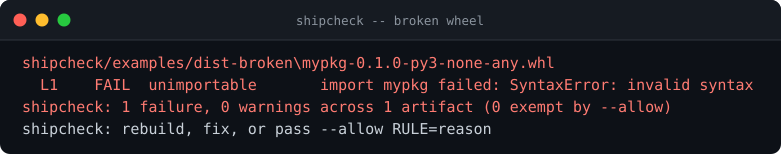
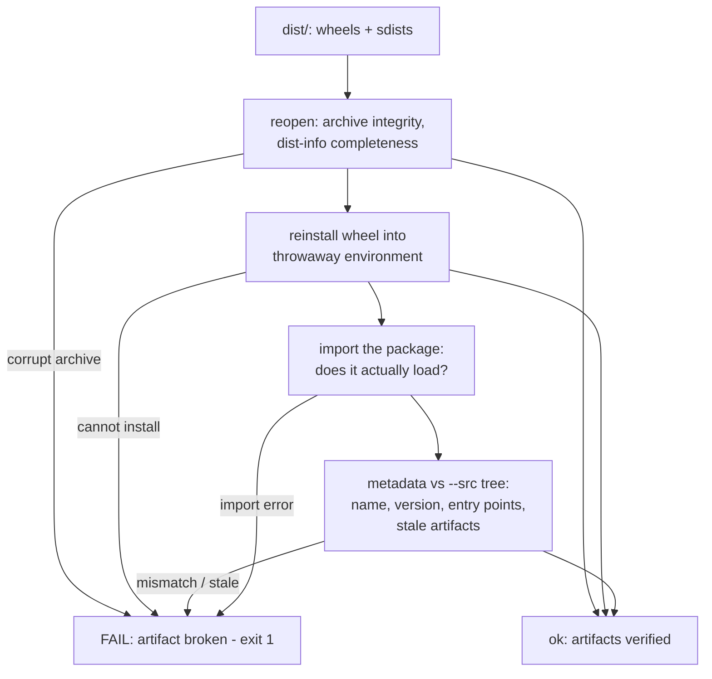

# shipcheck

**Verify the artifact you are about to ship - by shipping it to yourself.** Reopen every wheel and sdist, reinstall the wheels into a throwaway environment, import the package, compare its metadata against the source tree, catch stale builds. The PyPI upload that embarrasses you is always a *packaging* failure, and it is findable in seconds - before upload.

[](https://github.com/F0Rextasy/shipcheck/actions/workflows/test.yml)
[](https://www.python.org/)
[](https://skills.sh/F0Rextasy/shipcheck)
[](LICENSE)



## Why this exists

The tests passed on `main`. The wheel was built, twine upload went green, and users got a package that dies on `import` - the build had picked up an old `__version__`, or the module was never added to the wheel, or `dist/` still held last month's artifact. Tests validate your *source*; nobody was validating the *artifact*. `shipcheck` treats the built package as the product: it installs it the way pip will, imports it the way users will, and diffs its metadata against the tree you thought you shipped.

## Quick start

```bash
# install the skill into any agent (Claude Code, Codex, Cursor, OpenCode, ...):
npx skills add F0Rextasy/shipcheck

# or run it directly:
git clone https://github.com/F0Rextasy/shipcheck
cd myproject && python -m build
python /path/to/shipcheck/scripts/shipcheck.py dist --src .
```

| Exit | Meaning |
| --- | --- |
| `0` | every artifact opens, installs, imports, matches its metadata |
| `1` | a broken artifact (or a warning with `--strict`) |
| `2` | usage error |

`--allow RULE=reason` exempts one rule with a recorded reason; `--format json` for machines.

## What it checks



Full rule catalogue with severity and the `--allow` exemption contract: [references/RULES.md](references/RULES.md).

## Evidence (real output)

A wheel that does not import - caught from `dist/`, no upload attempted:

```console
$ python scripts/shipcheck.py examples/dist-broken
shipcheck/examples/dist-broken\mypkg-0.1.0-py3-none-any.whl
  L1    FAIL  unimportable       import mypkg failed: SyntaxError: invalid syntax
shipcheck: 1 failure, 0 warnings across 1 artifact (0 exempt by --allow)
shipcheck: rebuild, fix, or pass --allow RULE=reason
[exit 1]
```

The same gate green on a fresh build (fixture reproducible: `python examples/make_fixtures.py`):

```console
$ python scripts/shipcheck.py examples/dist --src examples/src
shipcheck: clean -- 2 artifacts checked, 0 findings (0 exempt by --allow)
[exit 0]
```

Try the fixtures: `examples/dist` is deliberately clean, `examples/dist-broken` deliberately is not.

## Wire it into CI

```yaml
- uses: actions/checkout@v4
- uses: actions/setup-python@v5
  with:
    python-version: "3.12"
- run: python -m build
- name: artifact gate
  run: python shipcheck/scripts/shipcheck.py dist --src . --strict
```

The last step between `python -m build` and `twine upload`.

## What it will never do

- Trust a filename: artifacts are reopened as archives and installed, not inspected from the outside.
- Touch your real environment: reinstall goes into a throwaway target.
- Skip silently: an unreadable `dist/` is a usage error (exit 2), never a green run.

## The family

Deterministic gates - one Python script each, stdlib, same exit contract:

| Gate | Catches |
| --- | --- |
| [preflight](https://github.com/F0Rextasy/preflight) | committed `.env`, weak secrets, debug-in-prod, wildcard CORS |
| [bandaid](https://github.com/F0Rextasy/bandaid) | symptom-suppression patches: swallowed errors, disabled tests, removed guards |
| [prove-it](https://github.com/F0Rextasy/prove-it) | claims with no executed evidence behind them |
| [testgate](https://github.com/F0Rextasy/testgate) | tests that can never fail |
| **shipcheck** (this repo) | broken, unimportable, or stale release artifacts |
| [dsh-gate](https://github.com/F0Rextasy/dsh-gate) | red turns closing green in DeepSeek Harness |
| [ci-triage](https://github.com/F0Rextasy/ci-triage) | red CI triaged without an LLM |
| [docproof](https://github.com/F0Rextasy/docproof) | documentation snippets that no longer parse or run |

## License

[MIT](LICENSE)
